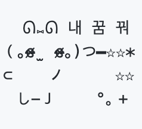

# RecorDream 💿
> 기상 직후의 꿈 기록과 관리를 돕는 Dream Archiving Service <br>
<br />

> 30th THE SOPT AppJam <br/>
> 프로젝트 기간: 22.07.09 ~ 22.07.23

<br>

## About


<br />


## 🍎 RecorDream iOS Developers


| `Create` | `Share` | `Play` |
|:--:|:--:|:--:|
||||
|**소진**|**은희**|**윤휘**|
|[@513sojin](https://github.com/513sojin)|[@EunHee-Jeong](https://github.com/EunHee-Jeong)|[@88yhtserof](https://github.com/88yhtserof)|
|`Record View` <br> `Home View` <br> `Reusable Component`|`Custom Tabbar` <br> `Storage View` <br> `Search View`|`Remote Notification` <br> `Detail View` <br> `Mypage View`|
| `Custom UI` | `Project Setting` | `FCM Setting` |


<br />

## 🛠 Development Environment

## 📚 Package Dependency

| Name | Tag | Management Tool |
| --- | --- | --- |
| HeeKit | Global Extension | SPM |
| IQKeyboardManager | Layout, Keyboard | - |
| SnapKit | Layout | - |
| Then | Sugar API | - |


<br />

## ✔️ Convention

`Coding Convention` · `Git Flow`

<details markdown="1">
<summary>Coding Convention</summary>

<br>
👉 Team Wiki 보러가기 https://github.com/TeamRecorDream/RecorDream-iOS/wiki/%08Coding-Convention

</details>

<details markdown="2">
<summary>Git Flow</summary>

<br>

```
1. Issue를 생성한다. // 작업의 단위, 번호 부여

2. Issue의 Feature Branch를 생성한다. // ex - feature/#이슈번호

3. ~작업~ // Add - Commit - Push - Pull Request 의 과정

4. Pull Request가 작성되면 작성자 이외의 다른 팀원이 Code Review를 한다.

5. Code Review가 완료되고, 2명이 Approve 하면 Pull Request 작성자가 develop Branch로 merge 한다. // Conflicts 방지

6. 다른 팀원들은 merge된 작업물을 pull하고 다시 각자 맡은 작업을 이어나간다.
```
</details>

<br />

## 🗂 Project Architecture

```swift

RecorDream-iOS
 ├── Info.plist
 ├── Resource
 │   ├── Assets
 │   │      └── AppIcon.xcassets
 │   ├── Colors
 │   │      └── Colors.xcassets
 │   ├── Images
 │   └── Fonts
 ├── Source
 │   ├── Application
 │   │   └── AppDelegate
 │   │   └── SceneDelegate
 │   ├── Common
 │   │   └── Constants
 │   │          └── ColorFactory
 │   │          └── FontFactory
 │   │          └── ImageFactory
 │   │   └── Protocols
 │   ├── Presentation
 │   │   └── Create
 │   │        └── Models
 │   │        └── ViewControllers
 │   │   └── Play
 │   │        └── Models
 │   │        └── ViewControllers
 │   │   └── Share
 │   │        └── Models
 │   │        └── ViewControllers
 │   └── Service
 │       └── DTO
 │            └── Network
 │              └── EndPoint
 │              └── Manager
 │       └── Mock 
 └── RecorDreamTests
 
HeeKit
 ├── Sources
 │     └── HeeKit
 │           └── Protocol
 │           └── Extensions
 ├── Tests
 │     │
 └──   └── HeeKitTests
```
